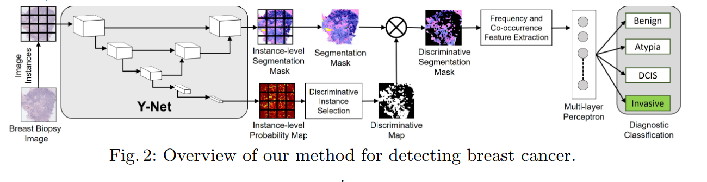

# YNet
## Dataset 
The dataset used is available in [this](https://www.bcsc-research.org/data/variables/) post.

A total of 87 pathologists diagnosed a randomly assigned subset of 60 slides into four diagnostic categories producing an average of 22 diagnostic labels per case.  The average size of these ROIs is 10,000×12,000. Out of these 200 ROIs have been used.

The four diagnostic categories are : i) benign ii) atypia  iii) ductal carcinomain situ iv) invasive cancer

Patch Size used : 256 X 256

Image Format : RGB

Pre-Processing : 256 X 256 patches are cropped from the high redolution ( 10000 X 12000 ) images without any overlap. As there is no seperate test dataset 15% of the extracted patches are kept aside for testing and the rest are used for training. Pixel values are normalized before training.

Magnification : 100x

## Model
[Y-net](https://arxiv.org/pdf/1806.01313.pdf): 




Citation 

``` @inproceedings{mehta2018ynet,
  title={{Y-Net: Joint Segmentation and Classification for Diagnosis of Breast Biopsy Images}},
  author={Sachin Mehta and Ezgi Mercan and Jamen Bartlett and Donald Weaver and Joann  Elmore and Linda Shapiro},
  booktitle={International Conference on Medical image computing and computer-assisted intervention},
  year={2018},
  organization={Springer}
}
```
