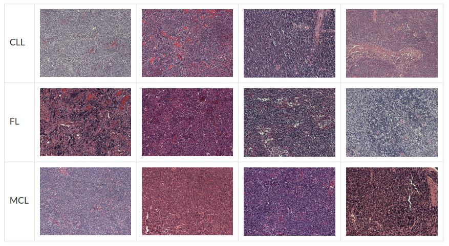

# Lymphoma Cancer Classification
In this implementation, three different Lymphoma subtypes are considered to classify from pathological images:
- Chronic lymphocytic leukemia (CLL) 
- Follicular lymphoma (FL)
- Mantle cell lymphoma (MCL). 

The following figure shows three different type of cancer cells.

### Dataset Preparation
The [dataset](http://www.andrewjanowczyk.com/use-case-7-lymphoma-sub-type-classification/) consist of 374 images of size 1388 x 1040. These are further broken down into 113 for the CLL class, 139 for the FL class and 122 for the MCL class. The data has been curated from multiple sources to create a real-world type cohort which contains typical stain and scanning variances. 
Non-overlapping patches of size 256 x 256 are extracted from each image. 15% from the total data is set apart of validation. Data is augmented using Keras' ImageDataGenerator.
### Inception Recurrent Convolutional Neural Network
The IRCNN architecture consists of general convolution layers, IRCNN blocks, transaction blocks, and a softmax logistic regression layer.

The IRCNN block, performs recurrent convolution operations on different sized kernels.

As the input and output dimensions do not change, this is simply an accumulation of feature maps with respect to the time step considered. This helps to strengthen the extraction of the target features.
In the transaction block, three operations (convolution, pooling, and drop-out) are performed depending upon the placement of the block in the network. According to Figure,  all of the operations are applied in the very first transaction block and second transaction block. The third transaction block consists of convolution, global-average pooling, and drop-out layer. The GlobalAveragePooling layer is used as an alternative to a fully connected layer.
The Stochastics Gradient Descent (SGD) optimization method is used with initial learning rate 0.01
### Usage
The models folder contains Keras model and it's corresponding tensorflowjs model. Download the .zip file of repository and load the model in caMicrscope.
### References
- Advanced Deep Convolutional Neural Network Approaches for Digital Pathology Image Analysis: a comprehensive evaluation with different use cases
Md Zahangir Alom, Theus Aspiras, Tarek M. Taha, Vijayan K. Asari, TJ Bowen, Dave Billiter, Simon Arkell
- M. Liang, X. Hu, "Recurrent convolutional neural network for object recognition", CVPR, pp. 3367-3375, 2015.
- Inception Recurrent Convolutional Neural Network for Object Recognition
Md Zahangir Alom, Mahmudul Hasan, Chris Yakopcic, Tarek M. Taha
